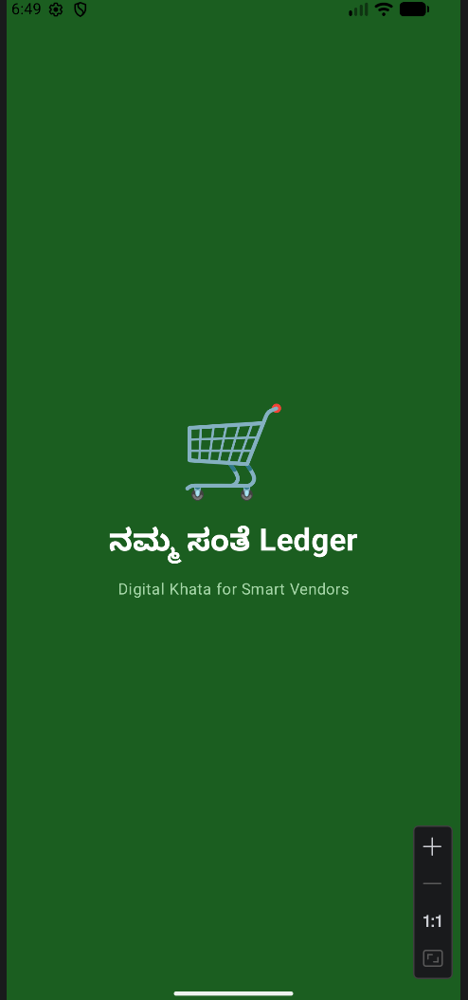
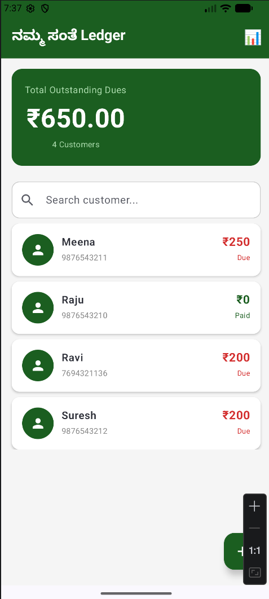
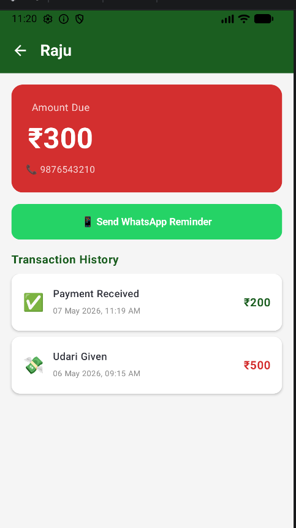
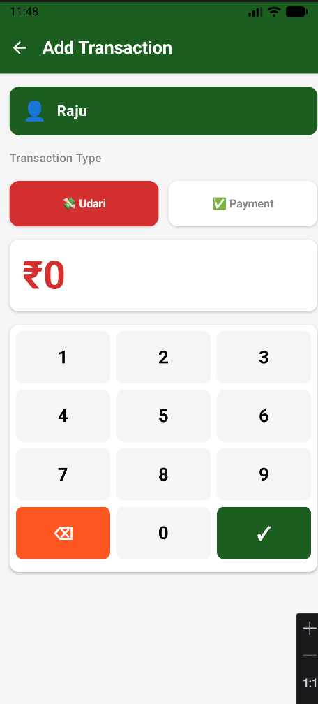
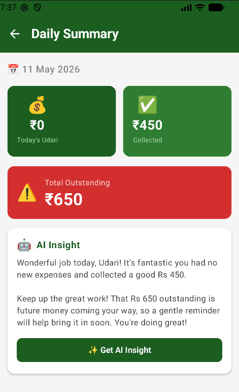

# Namma-Santhe Ledger

## Project Title
Android App Development using GenAI – Namma-Santhe Ledger (Finance)

---

## Project Description

Namma-Santhe Ledger is a GenAI-powered Android application developed to help small vendors digitally manage Udari (credit) transactions and customer payments. In rural weekly markets called Santhe, vendors usually maintain handwritten records, which can lead to lost entries, calculation mistakes, and unpaid dues.

This application replaces traditional bookkeeping with a simple digital ledger system that works offline and allows vendors to quickly add customers, record transactions, track balances, and send payment reminders. The app also integrates Google Gemini AI to generate smart daily financial insights for better business tracking.

The project is designed for small shopkeepers, local vendors, and rural micro-business owners who need an easy and efficient finance management solution.

---

## Features

- Add and manage customers
- Record Udari (credit) transactions
- Record customer payments
- Real-time outstanding balance calculation
- Offline-first functionality using Room Database
- Fast customer search
- WhatsApp payment reminder feature
- AI-powered daily financial insights
- User-friendly Android interface

---

## Tech Stack

- Kotlin
- Jetpack Compose
- Room Database
- MVVM Architecture
- StateFlow
- Google Gemini AI API
- Android Studio

---

## Installation and Setup Instructions

### Step 1: Clone the Repository

```bash
git clone https://github.com/GauriDesa/NammaSantheLedger.git
````

### Step 2: Open the Project in Android Studio

- Launch Android Studio
- Click on **Open**
- Select the cloned `NammaSantheLedger` project folder

### Step 3: Sync Gradle Files

- Wait for Android Studio to sync all Gradle dependencies automatically
- Make sure internet connection is enabled during sync

### Step 4: Connect Device or Start Emulator

- Connect an Android phone using USB debugging

OR

- Start an Android Emulator from Android Studio

### Step 5: Run the Application

- Click the **Run ▶️** button in Android Studio
- Select the device/emulator
- The app will install and launch automatically

### Step 6: Build APK (Optional)

To generate APK:

```bash
./gradlew assembleDebug
```

### Step 7: Install the APK Manually (Optional)

- Locate the generated APK file:
```text
app/build/outputs/apk/debug/app-debug.apk
```

- Transfer the APK to an Android device
- Open the APK file and install the application

> Note: Enable "Install from Unknown Sources" if prompted.

---

### Step 8: Use the Application

After launching the app, users can:

- Add customers
- Record Udari (credit) transactions
- Record payments
- View outstanding balances
- Search customers instantly
- Generate AI-based daily financial insights
- Send WhatsApp payment reminders

---

### Step 9: Internet Requirement

- The core application works completely offline
- Internet is only required for:
  - Google Gemini AI insights
  - WhatsApp message sharing

---

### Step 10: Future Enhancements

Planned future improvements include:

- Cloud synchronization
- Multi-language support
- Voice-based transaction entry
- Advanced analytics dashboard
- Dark mode support

---

## Folder Structure

```text
app/
 ├── data/
 ├── ui/
 ├── viewmodel/
 ├── utils/
 ├── navigation/
 └── MainActivity.kt
```

---

## Screenshots

### Splash Screen


### Home Screen


### Customer Details Screen


### Add Transaction Screen


### Daily Summary Screen


## Demo Links

### GitHub Repository
https://github.com/GauriDesa/NammaSantheLedger

### APK Download Link
https://drive.google.com/file/d/1m_e7W8AM1ZOX6rC-J_Cv2Eeo0I8eOPgf/view?usp=sharing

---

## Developed By

Gauri S  
JSS Academy of Technical Education
